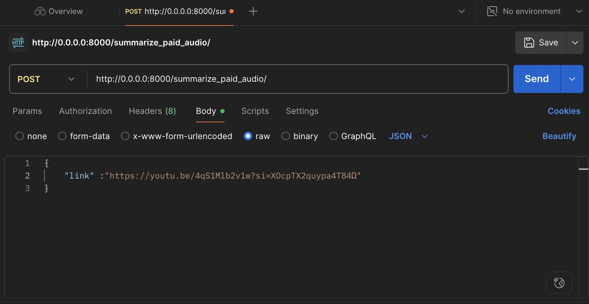

# ローカル環境でDockerfileを使って環境構築をしたい場合
MacとWindowsで違うかもしれないけれど，多分似通ってると思う．
**Dockerはインストールしていることが前提**

---

### 1.ターミナル/コマンドプロンプト上で`git clone`する
- `git clone`のコマンドは以下の通り

```bash
git clone https://github.com/Rikishi-com/3rd_generation_hackathon
```
- クローンしたいディレクトリにあらかじめ`cd`で飛んでおく

####　**GitHub**からクローンしたファイルは同一ディレクトリに保存する(以下のような構成にして)
```tree
├── 3rd_hackathon.pem
├── db.sqlite3
├── Dockerfile
├── main.tf
├── manage.py
├── readme_ueno.md
├── requirements.txt
├── summarizer_app
│   ├── __init__.py
│   ├── __pycache__
│   │   ├── __init__.cpython-312.pyc
│   │   ├── admin.cpython-312.pyc
│   │   ├── apps.cpython-312.pyc
│   │   ├── models.cpython-312.pyc
│   │   ├── urls.cpython-312.pyc
│   │   └── views.cpython-312.pyc
│   ├── admin.py
│   ├── apps.py
│   ├── migrations
│   │   ├── __init__.py
│   │   └── __pycache__
│   │       └── __init__.cpython-312.pyc
│   ├── models.py
│   ├── tests.py
│   ├── urls.py
│   └── views.py
├── temp
│   └── tmpi92gownf
│       ├── chunk_0000.mp3
│       ├── chunk_0001.mp3
│       ├── chunk_0002.mp3
│       ├── chunk_0003.mp3
│       ├── chunk_0004.mp3
│       ├── chunk_0005.mp3
│       ├── chunk_0006.mp3
│       └── XljbxPWvBLA_downloaded_audio.mp3
├── user_data.sh
├── variables.tf
├── vpc.tf
└── youtube_summarizer_project
    ├── __init__.py
    ├── __pycache__
    │   ├── __init__.cpython-312.pyc
    │   ├── settings.cpython-312.pyc
    │   ├── urls.cpython-312.pyc
    │   └── wsgi.cpython-312.pyc
    ├── asgi.py
    ├── settings.py
    ├── urls.py
    └── wsgi.py

```

---

### 2.dockerfileを使える形にする

#### 次のコマンドを順に実行していく
コピーでOK

---

**1**
```bash
docker build -t my-django-app .
```
- 初回はだいぶ時間かかります（上野は8分ぐらいかかりました）
- `Dockerfile`があるディレクトリに移動する
<br>

**2**
```bash
docker run -it -p 8000:8000 --name my_django_app my-django-app
```
- コマンドラインに入りたいときに使用する
<br>

**3**
```bash
python manage.py runserver 0.0.0.0:8000
```
- サーバ起動のコマンド
<br>

**4. `necessary.zip`内に含まれるファイルをコンテナ内にコピーする**
```bash
docker cp <ローカルのパス> <コンテナ名またはID>:<コンテナ内のパス>
```
- ローカル→コンテナ(**今回はこの操作のみ**)
- `test-753cb-c211d5dea50e.json`と`.env`の2つのファイルをコピーするため，それぞれのパスして実行する


```bash
docker cp <コンテナ名またはID>:<コンテナ内のパス> <ローカルのパス>
```
- コンテナ→ローカル(**今回は使わない**)


---

### Postmanを使って実行する
以下の写真のとおりに設定する
<br>


---

###　コピペ用

```POST
http://0.0.0.0:8000/summarize_paid_audio/
```
- POSTの部分

<br>

```bash
{
    "link" :"https://youtu.be/4qS1Mlb2v1w?si=XOcpTX2quypa4T84Ω"
}
```
- リンクは一例（あきとんとんの北海道の入試解説）
